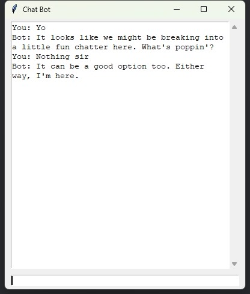

# Hotkey Activated Chatbot

This project is a simple chat application that communicates with an OpenAI API compatible chat service. It uses a small window for chat interactions and can be activated using a keyboard shortcut or through a system tray icon.

## Features

- Chat with an AI assistant powered by OpenAI API.
- Use the keyboard shortcut `Alt+D` to quickly open the chat window.
- System tray icon for easy access to the chat window and exit the program.

## Screenshots



## Usage

1. Clone the repository.
2. Install the required dependencies using pip:
    ```
    pip install -r requirements.txt
    ```
3. Run the `main.bat` file to start the application.

## System Tray Icon

The system tray icon provides quick access to the chat window and allows you to exit the program.


## License

[Apache 2.0](https://choosealicense.com/licenses/apache-2.0/)

## Discord Server

Join our Discord server [here](https://discord.gg/xhcBDEM3).

## Feeling Generous? 😊

Eager to buy me a cup of 2$ coffe or iced tea?🍵☕ Sure, here is the link: [https://ko-fi.com/drnicefellow](https://ko-fi.com/drnicefellow). Please add a note on which one you want me to drink?